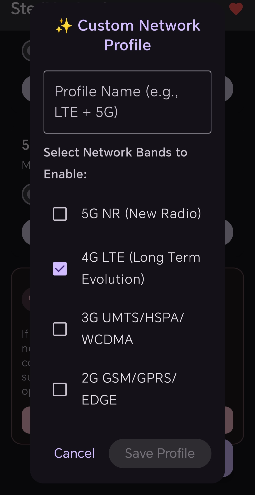
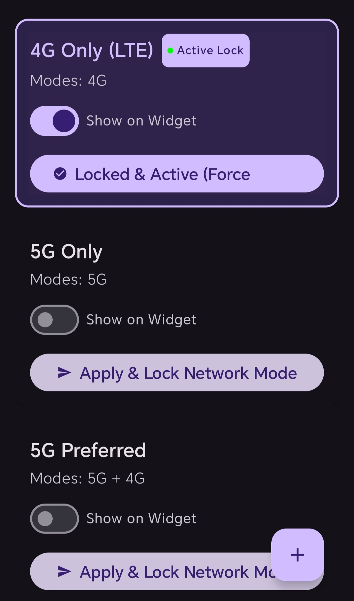
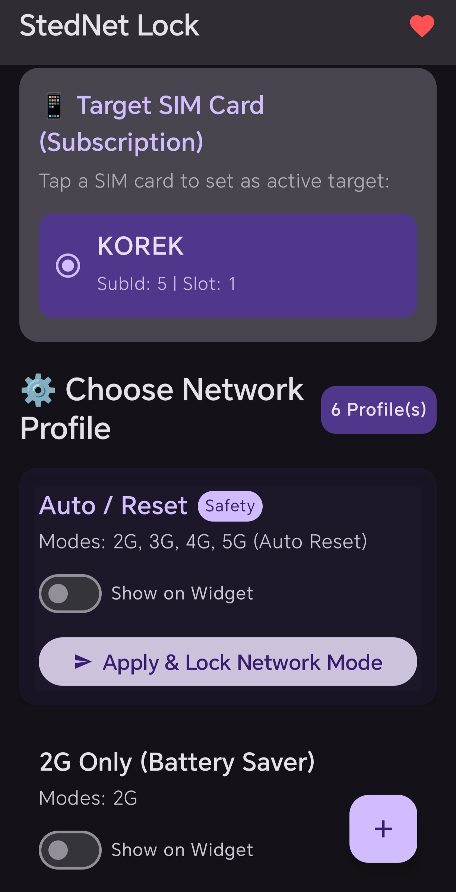

# StedNet-Lock

StedNet-Lock is a Shizuku-powered network switcher application for Android that enables you to toggle network modes and manage customized network profiles with ease.

## Screenshots

  
  
  

## Key Features

* **Network Mode Locking**: Lock your device to specific network modes (such as LTE-only or NR-only) that are not natively exposed in the system settings.
* **Profile Management**: Define and switch between customized network profiles quickly based on your connectivity needs.
* **Shizuku Integration**: Leverages secure Shizuku APIs to perform system-level network adjustments without requiring root access.
* **Private & Lightweight**: Built with a local-first architecture to ensure maximum performance and privacy.

## Prerequisites

To use StedNet-Lock, you must have Shizuku installed and active on your Android device:

1. Download and install Shizuku from the Google Play Store or GitHub.
2. Start the Shizuku service on your device (via Wireless Debugging, ADB, or Root).
3. Ensure the Shizuku manager app shows that the service is running.

## Installation

1. Navigate to the **Releases** tab of this repository.
2. Download the latest `.apk` release package.
3. Open the downloaded file on your Android device to install it.
4. Launch StedNet-Lock and grant it the requested Shizuku permission when prompted.

## Contributors

* Omer Kurdi
* Google AI Studio
* Google Antigravity CLI
* Termux

## License

StedNet-Lock is proprietary closed-source software. All rights reserved. Please refer to the [LICENSE](LICENSE) file for more information.
